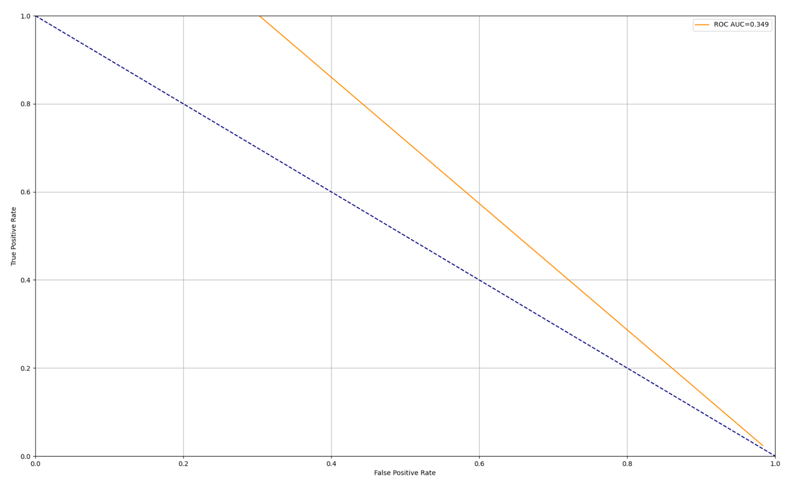

# StixelNet Metric - Evaluation Specification
The Output of this project is a single plot of TruePositives (tpr) against the relative False Positives (fpr), iterated
over an increasing tolerance.

## Definitions
__True Positive Rate (tpr)__: A result is tp if a target (ground truth) exists AND the prediction hits the target within
the tolerance.  
_The rate depends on the total amount of existing target data_  

__False Positive Rate (fpr)__: A result is a fp if a prediction is made but no target exists OR a prediction don't hit 
the target within the tolerance.  
_The rate is calculated over the amount of evaluated datasets e.g. every image with a width of 1920 x 400 test data_

## Iteration
Basically one point of the ROC curve is defined as __( fpr | tpr )__ with tolerance __t__. The curve is now increasing
the tolerance of when a prediction counts as match e.g. a Stixel is predicted at pixel: _800px_, target is _816px_ and the
tolerance is _8px_ in the second tolerance step: it counts as __fp__. In the third iteration __t__ _= 16px_ and it counts as
__tp__.

## Example 
